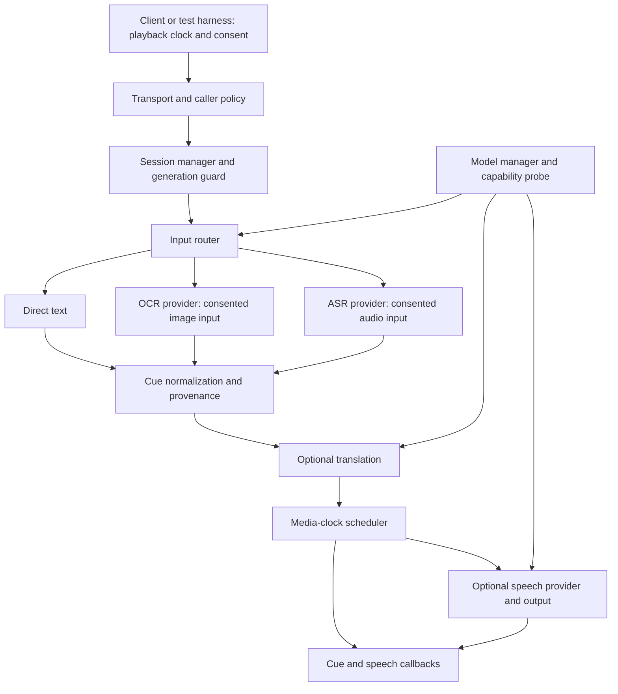

# AniSub canonical system design

Status: canonical boundaries v0.3, 2026-10-07. Windows prototype exists. Android ships the
major 1 / minor 1 contract with on-device AI narration (sherpa-onnx + Piper vais1000, consented
verified voice pack) plus the legacy system-TTS test; see android-addon-contract.md. P650 pending.

The next-stage [standalone runtime System Design](superpowers/specs/2026-10-07-anisub-runtime-design.md)
defines Android M1, model lifecycle, concrete limits and acceptance. The written spec is user-approved;
the [M1 implementation plan](superpowers/plans/2026-10-07-android-m1.md) awaits review before source execution.
[Claude addon handoff](android-addon-contract.md) separates callable private test major 1 from
proposed AI major 2. These Android wire limits override the older provisional semantic-fixture
budgets below for Android only; Node fixture remains a separate protocol implementation.
AniSub owns standalone runtime work; Claude owns AniBox addon. Do not edit AniBox in this scope.

Windows native prototype now additionally uses WPF/MediaElement and a persistent local Python
worker with pinned EN→VI and Vietnamese Nano models. This is a vertical slice, not the canonical
protocol-v1 transport or a chosen cross-platform production core. See [Windows app](windows-app.md)
and [ADR](adr-001-windows-native-prototype.md). A separate Android test service now exists, with
same-signature private Messenger IPC and system-TTS only; see apps/android/README.md in the repo.
It is not a production AI provider or the canonical semantic-v1 wire implementation. The new
standalone ExternalHost adds no-player operation, explicit selected-window OCR/process-audio
ASR and a local Chrome native broker. Chrome registration/installed-browser validation is
pending. See external-desktop.md for actual host capabilities and non-production limits.

[Windows harness](windows-harness.md) implements an in-process subset of these semantics with
deterministic fake providers and virtual output. It does not choose the Android/production core
language, implement cross-process trust/clocks, generate audio or measure inference latency.

## Product and deployment boundary

AniSub owns subtitle processing, optional translation and optional speech. The client owns
media playback, media clock, subtitle display, source/episode identity and audio ducking.
The runtime must work with a fake client before any AniBox integration.

Product priority: lightweight realtime video captions/translation, narration and experimental
live dubbing. Three planned surfaces share semantic contracts: a thin AniBox plugin/client
adapter, a Windows runtime application, and a Chrome extension companion. AniBox integration
is now owned by Claude outside this task; historical sketches are not a production addon SDK.
Android inference lives in the separately installed AniSub APK/service, not the AniBox plugin.

Windows sync007 additionally supports explicit complete-line narration: prefetch bounded future
utterances, preserve accepted speech across caption changes, and hold the media clock at due
boundaries if inference/previous narration needs extra time. Caption clearing does not terminate
accepted audio in this selected mode. Control invalidation still retires output with bounded fade;
EOF stops admission, not an accepted phrase. This trades brief client-owned video waits for no
silent dialogue drops. It is not currently a negotiated protocol-v1/Android capability.
Chrome's initial local-AI mode requires the Windows runtime; no browser-only inference parity
is promised. Captions remain useful when speech/model capabilities are unavailable.

See [realtime product design](realtime-product-design.md) for surface ownership, latency gates,
model-update policy and narration/dubbing tradeoffs. Realtime deadlines outrank batch throughput:
prefer bounded short utterances and expired-job drops over an ever-growing speech backlog.
No promise of zero-latency translation, lip sync, original-dialogue removal or arbitrary DRM capture.

Initial implementation target: deterministic core with fake providers and a desktop harness.
Android APK/service currently provides a separate private test transport; AI orchestration is
the next planned host of these semantic contracts. Shared semantics do not
imply identical binaries: choose the concrete core language/build system in phase 1 after a
small Android/Windows portability spike. Do not prematurely bind the core to Python, JNI or
Android classes. A C++ core is a candidate if in-process Windows/Android reuse justifies its cost;
otherwise host-specific orchestration must pass the same conformance fixtures.

Node is the current dependency-free Windows fixture executor only. Phase 1 still requires an
Android portability spike before claiming shared production implementation. Recreate the fixture
after its explicit 1024-session lifetime bound; production replay prevention remains a host design.

No mandatory cloud server. Optional online translation providers need explicit consent and
their own credentials. Offline providers report unavailable when unsupported; no silent cloud fallback.
Desktop acceleration and Android capability profiles are separate deployment choices. Android TV
support, including API 23, is a validation target and not an assertion of model viability.

## Ownership

| Module | Owns | Does not own |
|---|---|---|
| protocol | versioned DTOs, enums, schemas, bounds | engines, UI, session decisions |
| core | session state, routing, cancellation, media-clock scheduling | Binder, HTTP, model implementations |
| providers | engine-specific conversion and inference | playback control, session lifetime |
| model-manager | model manifests, integrity, storage, load leases | choosing subtitle input or language |
| apps/android | service lifetime, caller trust, permission UX, Android transport | inference policy inside UI/service callbacks |
| apps/desktop | local host, settings, diagnostic harness | changing protocol semantics |
| tests | fixtures and evidence | production fallback decisions |

## Input routing

Use verified direct text first, including embedded or sidecar subtitles supplied by the client.
An empty active-cue snapshot means no subtitle at that instant; it does not prove absence of a
subtitle track and must never trigger OCR/ASR on its own. Track availability and input mode are
explicit session metadata.

OCR is eligible for bitmap/burned-in subtitles with image-input permission and a supported
provider. ASR is eligible only when usable text/OCR is unavailable and audio input is authorized.
Availability must be negotiated; provider latency/error is not permission to silently change modes.
Prefer one input path at a time to prevent duplicate captions/speech. Preserve original text,
language, timestamps, provenance, confidence and any user edits alongside derived results.

Hard subtitles cannot be read from another app without an explicitly designed capture path.
Android MediaProjection/platform playback capture availability, permission and protected-content
limits must be checked in the host implementation. No fallback architecture assumes access to
decoded frames or audio from arbitrary apps. Future cooperating clients may supply permitted input.

## Session and cancellation

One session represents one episode/source context. A new episode/source creates a new opaque
session id; client-owned durable references contain no stream URL. Each session has a monotonic
revision. SEEK, PAUSE, STOP, speed changes, subtitle-track changes and reconnect recovery retire
pending work as required by protocol.md. Every provider request/result carries session and revision.
The coordinator checks them before enqueue, after inference, before output and before callbacks.
Terminal speech cleanup is the explicit exception: the active-speech ledger may accept FINISHED
for an already accepted old speech exactly once, or locally finalize it during invalidation.
An old terminal callback cannot affect a newer speech; stale STARTED/results always remain rejected.

STOP/close cancels jobs, clears queues, stops output and releases model leases. Binder death or
transport disconnect does the same. Reconnect starts a new session, never replays historical speech.
Cancel is idempotent. A provider that cannot interrupt inference may finish, but its retired result
is discarded. The core uses one serial session executor; provider work uses bounded worker pools.

## Synchronization and speech

The media clock belongs to the client; wall-clock inference duration is not media time. Map client
clock anchors to local monotonic time, accounting for play/pause and speed. Seek/revision resets
the mapping. An active snapshot's observed timestamp is not a known cue start; unknown bounds
remain unknown. Do not invent end time or queue speech for already expired cues.

Initial budgets: at most 32 cues/snapshot, 4096 UTF-16 units/cue, 256 KiB/transport message;
8 pending processing jobs/session; 2 queued speech segments; 5 seconds maximum queued media horizon.
When full, drop obsolete derived work first and report BACKPRESSURE. These are provisional test
limits, not throughput claims. Measure latency/RTF per provider/device before declaring realtime.

Speech STARTED means output actually starts, not inference submission. FINISHED follows actual
completion/cancel/error, exactly once per accepted STARTED. Return speech id and session/revision.
The client implements ducking using its existing audio policy. A future Android speech host must
negotiate output ownership/audio focus rather than competing with the media client's focus.

## Model and provider lifecycle

Each provider implements capability probe, prepare, process, cancel and release. Model manifests
include id/version, upstream source, license reference, expected digest/size, supported host,
languages and memory budget. Download requires explicit user action, bounded/resumable transfer,
digest validation and atomic installation. Never trust a model directory solely because it exists.

Load leases reference-count scarce resources. Start with one active heavy provider per device
profile, rather than loading OCR, ASR and TTS simultaneously. This initial low-resource policy
does not imply live ASR + translation + TTS can fit: capability admission must check the whole
pipeline's concurrent residency and deadlines. If it cannot fit, offer captions-only or a
user-selected compatible profile; never thrash models per cue or silently change input mode.
Model unload, cache quota and LRU
eviction are centralized. No native/model payload is bundled until licensing, ABI, storage and
device measurements pass. VieNeu-TTS, OmniVoice, audio.cpp, Whisper, SenseVoice and Supertonic
are evaluation candidates only; no current feature/license/performance claim is made here.

Separate application/adapter releases from model-data releases. A small trusted catalog may be
checked regularly under user-configured update policy; continuous upstream changes are not
automatically promoted. Models are immutable bundles pinned by digest and compatible provider,
schema, language/task and host requirements. Signed metadata, expiry/anti-rollback policy and
trusted-key rotation must be designed before automatic catalog acceptance. License changes
require approval. Native libraries, Python/model code and extension code are application/provider
releases, never hidden model-data updates. No automatic training or arbitrary Hub execution.

Download/stage within disk/network quotas, verify every artifact, run compatibility and smoke
checks, then atomically promote only for new sessions. Active sessions retain their lease on
the old version. Failed candidates remain quarantined; keep a last-known-good version within
quota and allow explicit rollback. Missing storage or an incompatible update leaves the existing
version usable. Catalog checks/installation cannot compete with active video workloads by default.

## Research-informed provider constraints

See [repo research](research/README.md) for the dated primary-source evidence and conditional
shortlist. Capability negotiation is per artifact/backend/host/mode, not library-wide. Distinguish
full utterance, completed text chunks and incremental PCM; ASR input languages, alignment
languages, translation pairs and TTS output languages are separate capability dimensions.

Manifest assets form a reviewed dependency graph: weights, tokenizer, codec, G2P/dictionary,
voice assets and native libraries each need version/digest/size/license records. No implicit
Hub fetch or remote model code execution during prepare. Downloads remain explicitly authorized.
Cancellation advertises cooperative abort, discard-only, or worker termination; output-stop
and retired-result guards cannot depend on native inference terminating immediately. Process
isolation is a reliability option, not a license exception. First PCM and first audible output
are measured separately. Windows prototype providers are pinned and tested on synthetic inputs;
production selection still requires representative long-video quality/resource/deadline gates.

## Reliability, privacy and observability

Typed errors distinguish unsupported capability, denied input, protocol mismatch, provider failure,
model failure, timeout and backpressure. Retries are bounded and allowed only for current revision;
model failures must not produce infinite reload loops. Disconnect leaves client playback operational.

Raw image/audio and cue content are transient by default. Persist explicit settings/model metadata;
keep text-result caching opt-in with a quota, keyed by source text, language pair and model version.
Record counts, queue depth, processing latency, cancellation and dropped-job reasons without content.
Allow diagnostic exports only with redaction and consent.

## Decisions to revisit

Validate the core language with the portability spike; pin Android Binder schema after the fake
runtime is stable; choose each provider from measured device evidence; tune queue/memory budgets
from benchmarks. Cross-device desktop-to-TV transport, voice cloning and automatic capture are
separate future scopes. No LAN/API endpoint is enabled by this design baseline.
